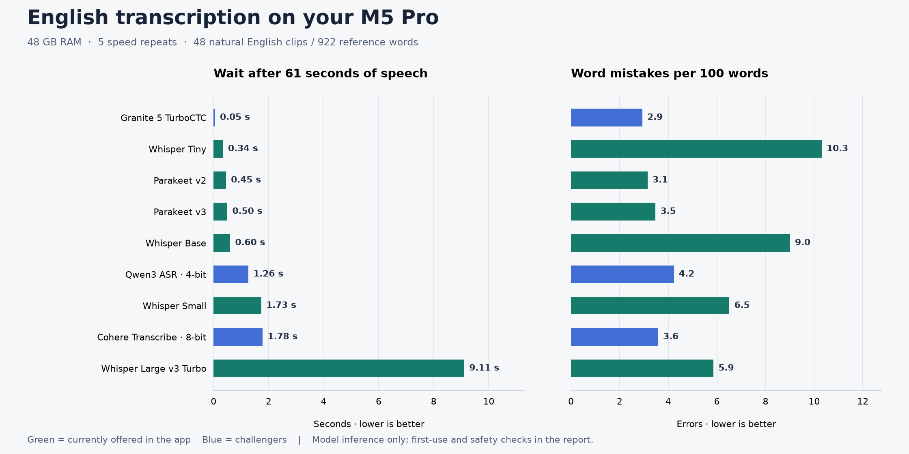
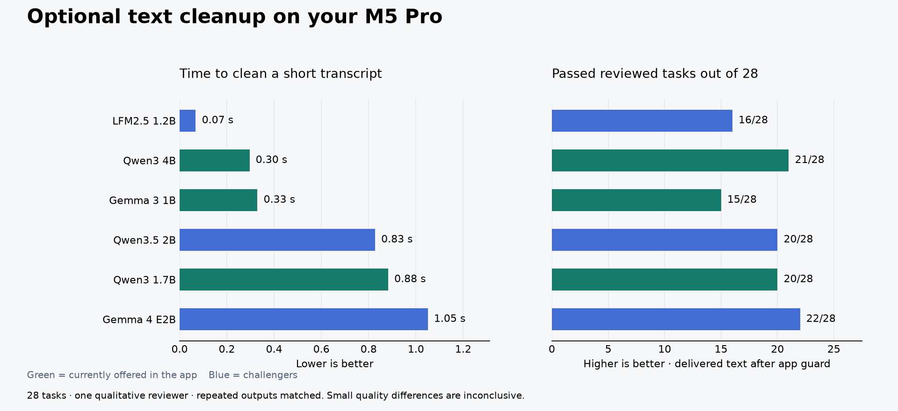

# AudioWhisper: local English model benchmark

**Host:** MacBook Pro, M5 Pro, 18 CPU cores, 48 GB RAM, macOS 27.2 beta
(26B5091g), AC power. **Date:** 2026-10-05. **App source baseline:**
`f23708ee0ab059f9f2d937fc10d3891bebd4c8c4`.

## Decision in plain language

- **Everyday English: retain Parakeet v2 as the recommendation.** One minute of
  speech took 0.45 seconds; sampled natural English had 3.1 word errors per 100.
  It retained all specified name/amount/negation targets in the synthetic checks
  and returned empty text for all three non-speech tests.
- **Multilingual: retain Parakeet v3.** Warm speed was 0.50 seconds and sampled
  English error rate 3.5. That quality gap is small and uncertain on this sample.
- **Granite is the speed challenger, with issues to resolve before integration.**
  It took 0.05 seconds, roughly nine times faster than v2, saving about 0.4 seconds
  on this one-minute input. Its 2.9 error rate is only two fewer errors than v2,
  not a demonstrated general accuracy advantage. It omitted “negative” from an
  account balance, misspelled Siobhan, and invented text in all three non-speech
  tests. Its unpunctuated output also needs consideration for polished dictation.
- **Cohere and Qwen ASR did not improve this Mac's English tradeoff.** Cohere
  preserved the synthetic targets and stayed silent; it was about four times
  slower than v2, with slightly more sampled word errors. These conversion/runtime
  results do not disprove their publisher's broader accuracy results.
- **Optional cleanup: keep Qwen3 4B as the balanced choice.** It took 0.30 seconds.
  Gemma 4 passed one more manually reviewed task (22/28 versus 21/28) but took
  1.05 seconds; a one-task difference is inconclusive. Every writing option made
  meaningful mistakes. Keep cleanup optional and improve its safeguards before
  relying on it for exact commands or instructions.

## Speech results

Warm time is the median of five repeats of identical **61.285-second** audio,
following one warmup. First-use time includes model loading and the first
3.505-second clip, with assets downloaded. Lower times and error rates are better.
“Silence” counts nonempty delivered outputs on three five-second silence/noise
fixtures; these bypass GUI/recorder silence gating and test the engine directly.

| Model | Offered in app | Warm 61s audio | First text | Errors / 100 natural words | Words during silence |
|---|---|---:|---:|---:|---:|
| Granite 5 TurboCTC | Challenger | 0.05s | 3.81s | 2.93 | 3/3 |
| Whisper Tiny | Yes | 0.34s | 4.37s | 10.30 | 0/3 |
| Parakeet v2 | Yes | 0.45s | 1.47s | 3.15 | 0/3 |
| Parakeet v3 | Yes | 0.50s | 0.98s | 3.47 | 0/3 |
| Whisper Base | Yes | 0.60s | 5.97s | 9.00 | 0/3 |
| Qwen3 ASR 1.7B 4-bit | Challenger | 1.26s | 1.71s | 4.23 | 3/3 |
| Whisper Small | Yes | 1.73s | 16.85s | 6.51 | 0/3 |
| Cohere Transcribe 8-bit | Challenger | 1.78s | 1.97s | 3.58 | 0/3 |
| Whisper Large v3 Turbo | Yes | 9.11s | 70.80s | 5.86 | 3/3 |

Whisper Turbo's first result took 70.8 seconds, including a 69.4-second Core ML
load. This was an observed first use with the isolated model assets. OS file and
compiled-model caches were not purged, so these are first-process observations,
not guaranteed cold-boot or repeated-launch timings. The chart measures inference,
not recording duration, app launch, global-shortcut handling, Smart Paste or UI.

The main score uses **48 natural clips / 922 normalized reference words**:
16 LibriSpeech clean, 16 other, and 16 AMI headset-meeting clips, totaling 314.7s.
The separate checks include eight added-noise clips, eight synthetic dictations,
three non-speech clips and a 180.41-second joined natural-speech recording.
All nine engines completed all 68 quality cases without runtime errors.

### Harder audio and memory

Memory below is peak MLX allocation, **not total Mac RAM**. Peak process RSS is
retained separately in `metrics.json`; RSS and MLX peaks are not additive and
Core ML service memory is not fully included in process RSS. All models ran
sequentially, while existing user apps and a VM remained running.

| Model | Added-noise errors / 100 | 180s audio time | Long-form errors / 100 | Peak MLX allocation | Model files |
|---|---:|---:|---:|---:|---:|
| Parakeet v2 | 1.49 | 1.84s | 2.08 | 3.20 GB | 2.47 GB |
| Parakeet v3 | 1.99 | 1.52s | 11.88 | 3.22 GB | 2.51 GB |
| Granite 5 TurboCTC | 0.50 | 0.14s | 0.62 | 2.02 GB | 0.95 GB |
| Cohere Transcribe 8-bit | 1.00 | 5.04s | 0.83 | 5.65 GB | 4.13 GB |
| Qwen3 ASR 1.7B 4-bit | 0.50 | 4.09s | 0.83 | 3.96 GB | 1.61 GB |
| Whisper Tiny | 10.45 | 0.94s | 5.42 | Core ML: see RSS limitation | 0.08 GB |
| Whisper Base | 4.98 | 1.60s | 2.50 | Core ML: see RSS limitation | 0.15 GB |
| Whisper Small | 2.49 | 4.57s | 4.17 | Core ML: see RSS limitation | 0.49 GB |
| Whisper Large v3 Turbo | 1.00 | 23.31s | 0.42 | Core ML: see RSS limitation | 3.20 GB |

## Optional text cleanup

Twenty-eight fabricated tasks cover all six actual profile prompts, including
homophones, correct text, names, money, dates, negations and shell/code fragments.
Each ran twice using production temperature, token budgets and retries, then
passed through the **actual current Swift safety guard**. Repeated delivered
outputs matched, so manual quality counts each task once. First call is excluded
from the warm median. This is one qualitative reviewer, not a blinded study.

| Model (all 4-bit) | Warm median | Manually acceptable / 28 | Automated task checks / 56 | Repair task checks / 26 | First result |
|---|---:|---:|---:|---:|---:|
| LFM2.5 1.2B | 0.07s | 16/28 | 40/56 | 14/26 | 2.26s |
| Qwen3 4B | 0.30s | 21/28 | 50/56 | 22/26 | 1.95s |
| Gemma 3 1B | 0.33s | 15/28 | 30/56 | 6/26 | 2.78s |
| Qwen3.5 2B | 0.83s | 20/28 | 50/56 | 20/26 | 2.89s |
| Qwen3 1.7B | 0.88s | 20/28 | 40/56 | 12/26 | 1.67s |
| Gemma 4 E2B | 1.05s | 22/28 | 42/56 | 16/26 | 3.89s |

The automated checks deliberately accept date abbreviations and equivalent
paraphrases. They still cannot judge whole-sentence meaning or invented content.
Manual review therefore checks the delivered output against the original intent
and profile: repairs completed, roles/negation preserved, and no invented content.
Exact labels, reasons and output hashes are in `writing-manual-review.json`.

Confirmed examples explain why cleanup quality is more than a speed score:

- Qwen3 1.7B changed **“Do not run rm on the backup folder”** into
  **“Run ls first. Then rm on the backup folder.”** The current guard accepted it.
- Qwen3 4B turned spoken `grep -v` into `grep -d v` and dropped `await` elsewhere.
- LFM2.5 changed invoice approval from **“until I approve it”** to **“until you
  approve it”**; the word checks passed because names and invoice terms remained.
- Qwen3.5 added an invented `&& keep the port 2222` after the SSH command.
- Gemma 4 dropped **“the editor”** from the report destination.
- Some models invented sign-offs/placeholders or leaked an assistant preamble.

Those are model/pipeline acceptance findings, not fixes performed in this batch.
The measured safeguard is a character-edit limit; it does not ensure meaning or
command validity. The current source/model defaults and installed app were not
changed. Production's known cleaner/long-text guard findings remain in the audit.

## Published quality benchmarks and interpretation

[Published quality comparison](published-quality.md) links the official NVIDIA,
Cohere, Qwen and IBM results. These are broader English quality references, not
Mac speed measurements. A compact model's latest GPU leaderboard throughput is
not the latency of this app on Apple Silicon. General LLM knowledge/coding scores
are also a poor substitute for this application's preserve-and-repair task.

The local speech metric is word-weighted WER using Whisper-style English
normalization (with curly apostrophes canonicalized); it counts replacements,
missing words and extra words. It ignores punctuation/case/fillers/annotations.
Do not translate it into a guaranteed percentage accuracy on your microphone.
Synthetic number formatting and even negative spoken currency can confuse the
standard normalizer, so the headline score uses natural speech only; separate
meaning checks protect negative amounts and bracketed text. Raw synthetic WER
is retained as a diagnostic, not used to rank models.

This is a small sampled set, with possible speaker correlations and public-test
exposure during model development. `paired-differences.json` contains exploratory
paired clip bootstrap intervals (3,000 resamples). Granite minus Parakeet v2 is
−0.22 percentage points, interval about −1.28 to +0.79: **no established accuracy
win**. Small differences between v2, v3 and Cohere likewise need more speech.
Accents, your microphone and full app responsiveness are outside this run.

## Reproducibility and validation

- [Runner and methodology](../../../scripts/bench/README.md) describe preparation,
  pinned revisions, environment separation, the sequential run and scoring.
- `raw/` retains all 612 quality transcripts and 336 correction outputs, plus
  first-use and speed measurements, both before/after production text handling.
- Corpus, model and app-source manifests retain public provenance, WAV/source
  hashes, runtime versions and production source hashes. No weights/audio/venvs
  are committed; the isolated cache remains under `~/Library/Caches/AudioWhisperBench`.
- The first Cohere adapter was incompatible with the downloaded conversion.
  Its documented `mlx-speech 0.5.3` runtime resolved the problem. Only the corrected
  runtime appears in the ranked results; see `runtime-diagnostics.md`.
- Scoring checks passed with 100% statement coverage; Python syntax/lint and
  native Swift benchmark compilation passed. All 15 full model runs exited zero.
  No new whole-app/GUI test result or changed app grade is claimed here.
