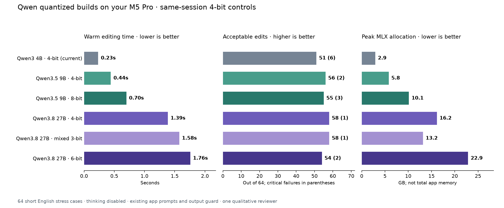

# Qwen quantized builds on Justin's M5 Pro

Measured 2026-10-06 against production source at
`f470703eb0bb3383f868a3716042fdd2e3ac7f45`. This evaluates the second-stage
English text editor after speech recognition. It does not change app defaults,
the installed build, permissions, or Parakeet v2/v3 selections.

**Mixed 3-bit 27B is the most interesting new candidate for further validation.**
It matched 4-bit acceptance with less memory. The 8-bit 9B gain depended on
the prompt; 6-bit 27B did not justify its added memory or latency in this sample.
Qwen3.5 9B 4-bit remains the balanced benchmark challenger. None was adopted.

## Existing app prompts, thinking disabled

| Published build | Accepted / 64 | Critical failures | Median warm edit | Peak MLX allocation |
|---|---:|---:|---:|---:|
| Qwen3 4B, 4-bit (current) | 51 | 6 | 0.23 s | 2.90 GB |
| Qwen3.5 9B, 4-bit | 56 | 2 | 0.44 s | 5.80 GB |
| Qwen3.5 9B, 8-bit | 55 | 3 | 0.70 s | 10.14 GB |
| Qwen3.8 27B, 4-bit | 58 | 1 | 1.39 s | 16.16 GB |
| Qwen3.8 27B, mixed 3-bit | 58 | 1 | 1.58 s | 13.18 GB |
| Qwen3.8 27B, 6-bit | 54 | 2 | 1.76 s | 22.85 GB |

The same-session 4-bit control judgments reproduce the previous study exactly.
The comparison above uses existing prompts with thinking disabled; it does not
represent the newer models through the app's current default thinking/retry path.

## Same models with the experimental preservation prefix

| Published build | Accepted / 64 | Critical failures | Median warm edit |
|---|---:|---:|---:|
| Qwen3 4B, 4-bit (current) | 57 | 4 | 0.26 s |
| Qwen3.5 9B, 4-bit | 55 | 2 | 0.52 s |
| Qwen3.5 9B, 8-bit | 57 | 1 | 0.74 s |
| Qwen3.8 27B, 4-bit | 60 | 2 | 1.57 s |
| Qwen3.8 27B, mixed 3-bit | 62 | 2 | 1.56 s |
| Qwen3.8 27B, 6-bit | 60 | 3 | 2.02 s |

The strongest acceptance count was 62/64 for mixed 3-bit with the prefix, but it
still made two critical omissions. The 8-bit 9B prefix condition had one critical
failure versus two on 4-bit 9B. These are different tradeoffs, not a universal
winner. The prefix remains experimental.

## What the new builds earned, in plain terms

1. **27B mixed 3-bit: keep as a candidate for lower memory.** With existing
   prompts it matched 4-bit at 58/64 and one critical failure, while using
   18% less peak MLX allocation (13.18 versus 16.16 GB). It exchanged one
   success for another: avoided the delivered quote defect, but omitted a
   request to document the thinking process. With the prefix it gained three
   cases and lost one versus 4-bit, reaching 62/64; it preserved an explicit
   command constraint but dropped the recipient qualifier "the editor."
   Memory savings did not establish a speed gain: the full direct task mix was
   14% slower, while the repeated identical short task was 3% faster.

2. **9B 8-bit: a prompt-dependent option, not a general upgrade.** With existing
   prompts it accepted one fewer case and made one more critical failure than
   4-bit. It repaired async/await but newly dropped a do-not-remove instruction.
   With the prefix it accepted two more cases and made one fewer critical
   failure; it repaired async/await and kept a do-not-append command constraint.
   Peak MLX allocation was 75% higher, and warm editing was 44–58% slower than
   the matched 4-bit conditions. That modest preservation gain needs broader
   validation before paying the memory cost.

3. **27B 6-bit: set aside for this use unless a larger corpus changes the result.**
   It accepted four fewer cases with existing prompts, including missing the
   obvious `you state` → `useState` repair. Its prefix condition tied 4-bit at
   60/64 but had one extra critical failure: it dropped the instruction not to
   append another command. It used 41% more peak MLX allocation and took
   27–29% longer to edit. Extra precision did not earn a cleanup benefit here.

All 27B builds passed the ten focused grammar cases; both 9B precisions and the
current 4B passed nine. That subset alone misses the email and preservation
failures. No build was flawless. [Full metrics](metrics.json) include per-profile
counts, p90 latency, identical-task repetitions, process RSS and startup samples.
[Pairwise cases](pairwise.json) identify gains and regressions against each
4-bit control. A Swift guard rejection is not automatically a failed edit:
returning the original can preserve an already-correct input.

## What was compared

Three additional published MLX builds were tested alongside fresh runs of their
4-bit controls and the current Qwen3 4B default:

- [Qwen3.5 9B MLX 8-bit](https://huggingface.co/mlx-community/Qwen3.5-9B-MLX-8bit).
- [Qwen3.8 27B MLX 6-bit](https://huggingface.co/lmstudio-community/Qwen3.8-27B-MLX-6bit).
- [Qwen3.8 27B mixed 3-bit](https://huggingface.co/leonsarmiento/Qwen3.8-27B-3bit-mlx).

Mixed precision is not a mixture of experts. This is a dense 27B model: most
language layers use 3-bit weights, embeddings/output head use 4-bit, and vision
layers use 8-bit. Images were not tested. The downloaded quantization settings
and tokenizer/template hashes are retained in [build-metadata.json](build-metadata.json).

These are comparisons of **published builds**, not a controlled experiment in
which the same weights were quantized locally with one converter. Converter,
template, and source/checkpoint choices may differ along with precision.
An observed improvement or regression cannot be attributed solely to bit width.
Exact repositories, revisions, paths and file sizes are in [models.json](models.json).

## Method and limits

- Physical Apple M5 Pro / 48 GB, AC power, macOS 27.2 beta build 26B5101f.
  Other desktop work and the macOS VM remained running. Inference was serial;
  downloads finished before any measured inference. See
  [starting hardware state](hardware-start.json), [ending state](hardware-end.json),
  and [per-model host counters](run-status-direct-strict.json).
- Six builds, two prompt conditions each: **768 delivered edits**, plus 72
  repeated speed calls. All 64 inputs were identical across configurations:
  short handcrafted English grammar, meaning, writing, email, chat, coding and
  terminal stress cases. [Cases](cases.json), [actual app prompts](prompts.json).
- Direct mode uses the existing six production profile prompts with thinking
  explicitly disabled. Strict mode adds the same experimental preservation
  prefix used in the prior study. Sampling, token budgets, Python correction
  path and actual Swift output guard remain unchanged. The prefix and thinking
  behavior have not been adopted in the app.
- Warm editing median covers 63 different tasks after excluding each mode's
  first task. The separate identical short-task median excludes the first of six
  repetitions. Fixed per-case seeds, temperature 0.2/top-p 0.9. Timing covers the
  Python correction call; the production Swift evaluation runs afterward.
  OS/file caches were not purged. One fresh-process startup per build is
  diagnostic, not a reliable
  cold-start ranking. End-to-end speech/paste latency was not measured.
- Peak MLX allocation and peak process RSS are different measurements. Allocation
  is the maximum across both conditions in one worker, not whole-app memory or
  an independent per-prompt peak. All GB figures use decimal bytes. Host swap
  counters describe the whole Mac, including other apps and the VM; they cannot
  establish memory traffic caused only by this benchmark.
- One qualitative reviewer, not an independently blinded panel. Identical
  case/input/category/delivered text reuses the previous judgment; app-failure
  attribution additionally requires identical raw generation. Every novel
  delivered output was manually reviewed against the unchanged criteria.
  [Hash-bound reviews](manual-review.json), [novel adjudications](manual-adjudications.json).
- Acceptable means the delivered edit completes the intended repair without
  adding or dropping information. Critical means changed intent/code or an
  omitted explicit constraint. These stress-case counts are **not an everyday
  failure percentage**, a public leaderboard, or proof of general model quality.
- Isolated benchmark runtime: MLX 0.32.3, mlx-lm 0.32.0, Transformers 5.18.0.
  [Frozen dependencies](requirements-bench.txt). No dependencies were installed
  into the app runtime. New model downloads total 45.99 GB and stay outside Git.
- No long dictation, multilingual, microphone, UI, or paste evaluation. This
  follow-up does not assign a new app grade. The
  [first Qwen comparison](../2026-10-06-qwen/README.md) and
  [broader speech/cleanup comparison](../2026-10-05-m5-pro/README.md) remain
  separate studies.

## Integration and reproduction

All six builds also loaded and corrected `she dont have the files yet` to
`She doesn't have the files yet.` using the installed app's read-only Python
runtime: MLX 0.32.0, mlx-lm 0.31.3, Transformers 5.10.1. Installed correction
and loader hashes matched before and after the check. This verifies basic
direct generation, not app UI, default-template behavior or paste acceptance.
See [installed-runtime-smoke.json](installed-runtime-smoke.json).

The previously reproduced [quote-stripping and thinking-template defects](../2026-10-06-qwen/README.md#confirmed-integration-problems)
remain unresolved. Thinking is disabled here to compare useful editing output;
these measurements do not demonstrate that a new build works through the app's
current default reasoning/retry path. A build can avoid a particular quote bug
by producing different text without fixing the app sanitizer.

Reproduction commands are in
[scripts/bench/README.md](../../../scripts/bench/README.md#additional-qwen-quantized-builds).
Use a fresh result directory for timing reruns. The worker refuses duplicate
appends. The report requires successful complete workers, the exact 64 cases per
condition, and output hashes matching the reviews. Re-review changed outputs.
Production source and benchmark script hashes are retained in
[source-manifest.json](source-manifest.json), [script-manifest.json](script-manifest.json),
  and [production-text-source.json](production-text-source.json).

[Validation evidence](validation.json): six successful workers, 12 reviewed
configurations, 43 novel outputs manually adjudicated, matching source/output
hashes, ten scoring tests, six installed-runtime smoke checks, and chart review.
