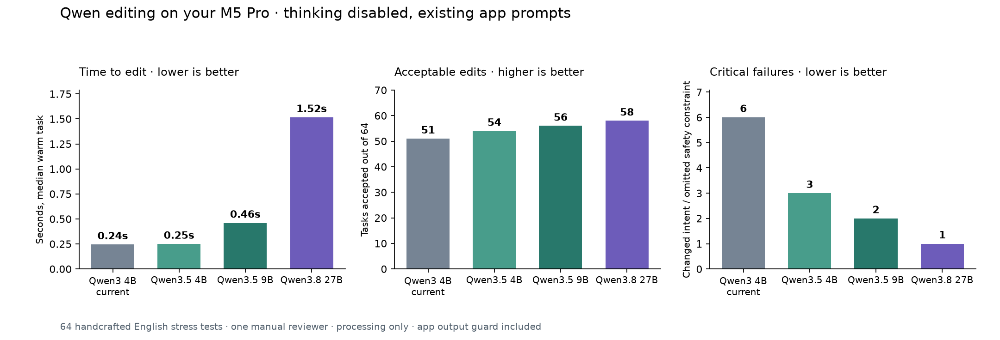

# Qwen cleanup comparison on Justin's M5 Pro

Measured 2026-10-06 against production source `a2285d3396c50b55babc0d0bcf294633fce15c89`.
This evaluates the second-stage text editor, after speech recognition. It does
not change the app, its selected models, or Parakeet v2/v3 behavior.

The subsequent [quantized-build comparison](../2026-10-06-qwen-quants/README.md)
adds 9B 8-bit and 27B mixed 3-bit/6-bit builds with fresh same-session controls.
The measurements below remain the original four-model study.

**Qwen3.8 27B gave the best results with existing prompts, but Qwen3.5 9B is the
more practical new challenger for quick dictation. Neither is a ready default
replacement.** The larger model accepted only two more tasks than 9B, took
3.3 times as long to edit, and used roughly 2.8 times the peak MLX allocation.
Prompt and output handling need work before adopting either model.

## Existing app prompts, thinking disabled

Every model uses 4-bit MLX weights, identical profile prompts, sampling settings,
token budgets, and the production Swift output guard. “Acceptable” means the
delivered edit fixed the intended problem without adding or dropping information.
“Critical” means changed intent/code or an omitted explicit constraint.

| Model | Median warm edit | Accepted / 64 | Critical failures | Model files | Peak MLX allocation |
|---|---:|---:|---:|---:|---:|
| Qwen3 4B Instruct 2507, current default | 0.24 s | 51 | 6 | 2.28 GB | 2.82 GB |
| Qwen3.5 4B | 0.25 s | 54 | 3 | 3.06 GB | 3.09 GB |
| Qwen3.5 9B | 0.46 s | 56 | 2 | 5.98 GB | 5.69 GB |
| Qwen3.8 27B | 1.52 s | 58 | 1 | 16.08 GB | 16.06 GB |

GB uses decimal bytes. File size and allocation are different measurements;
neither is whole-app memory. The repeated identical short task took 0.20, 0.23,
0.36, and 1.32 seconds respectively. Fresh-process time to the first result was
5.03, 2.91, 2.65, and 6.73 seconds, with files already downloaded and OS caches
left intact. One such startup per model is diagnostic, not a robust cold-start
ranking. Full timings and peak process RSS are in [metrics.json](metrics.json).

In plain terms: 4B is quick and small; 9B spends a little more time for better
handling of commands and meaning; 27B is stronger but costs much more memory
and a noticeable pause. These are cleanup times, not transcription or paste times.

## What actually improved

- All ten focused grammar cases passed on 27B. The smaller models passed nine:
  they left the equivalent of “We have already sent the report yesterday.”
- 27B accepted all five coding and seven terminal cases. 9B accepted four and
  five respectively. The samples include preserving `await`, command flags,
  code identifiers, and explicit instructions not to change a command.
- All eight writing cases passed for every model. This sample did not establish
  a prose-style winner.
- Email remains weak: 27B and 9B each accepted five of nine email tasks, versus
  seven on the current 4B. They added closings such as “Best regards” when the
  source contained no closing. A smarter general model can still over-edit.
- 27B retained “Do not replace -v with -d” and “Do not append another command”
  where 9B's direct mode dropped those independent constraints. It still dropped
  a dictated do-not-remove instruction in another case.

## Prompt experiment: improvement is not automatic

An experimental preservation prefix was prepended to the same six app prompts.
It asks the model to edit source text, retain constraints and facts, and avoid
inventing sign-offs, facts, or code. This prefix has **not** been adopted in the app.

| Model | Accepted with existing prompts | Accepted with stricter prefix | Critical with stricter prefix | Warm edit with stricter prefix |
|---|---:|---:|---:|---:|
| Current Qwen3 4B | 51 | 57 | 4 | 0.27 s |
| Qwen3.5 4B | 54 | 51 | 4 | 0.29 s |
| Qwen3.5 9B | 56 | 55 | 2 | 0.49 s |
| Qwen3.8 27B | 58 | 60 | 2 | 1.56 s |

The current small model improved substantially without changing weights. 27B
stopped inventing email closings, but then dropped a command constraint that its
original prompt preserved. 3.5 4B invented a financial projection in one strict
trial. Higher acceptance alone is insufficient: inspect the critical failures.
These are single seeded trials, and the mixed results require further validation.

## Confirmed integration problems

1. **Closing quotation marks can disappear.** The model generated a balanced
   quotation; `sanitize_model_output()` removed its closing quote with the
   unconditional edge quote stripping. The delivered text was malformed. This
   was counted as an app failure, not a model failure. See
   [quote-cleaner-reproduction.json](quote-cleaner-reproduction.json).
2. **Qwen3.8 default thinking is incompatible with current parsing.** Its template
   includes the opening `<think>` in the prompt. Generated continuation therefore
   begins with untagged reasoning, which the app does not recognize. The short
   generation budget is spent on reasoning; the Swift guard rejected all 19
   diagnostic outputs, returning the original input. Median diagnostic time was
   8.54 seconds. We deliberately terminated that worker after 19 cases; its
   recorded exit `-15` is an intentional stop, not an app crash. See
   [thinking-template-reproduction.json](thinking-template-reproduction.json).
3. **Qwen3.5 pays for unnecessary retries.** With the current template defaults,
   all 64 cases on both 3.5 models required a second generation with thinking
   disabled. Median edits took 1.79 seconds on 4B and 2.96 seconds on 9B, versus
   0.25/0.46 seconds when directly requesting non-thinking output. Production-mode
   acceptance was 55/64 and 53/64 respectively. The current non-thinking Qwen3
   Instruct default required no such retry and accepted 51/64.

All four models also loaded and produced a short correction in a separate
read-only smoke check using the installed app's Python runtime: MLX 0.32.0,
mlx-lm 0.31.3, Transformers 5.10.1. The installed Python source hashes matched
the benchmarked source. This verifies basic loading and direct generation,
not complete app integration, long dictation, recording, or paste behavior.
See [installed-runtime-smoke.json](installed-runtime-smoke.json).

## Recommendation

Keep the current cleanup default while addressing the two output-handling bugs
and eliminating the thinking retry for editing. Evaluate Qwen3.5 9B as a balanced
optional challenger and Qwen3.8 27B as a quality-oriented option for Macs with
ample memory. Do not adopt the experimental prefix wholesale: it improved some
models and worsened others. Expand the corpus with long dictation, emails, and
user-approved examples before changing a default.

Qwen's official [3.8 27B card](https://huggingface.co/Qwen/Qwen3.8-27B) describes
the newer model and its flexible thinking controls. The
[3.5 9B card](https://huggingface.co/Qwen/Qwen3.5-9B) documents the smaller
generation. Their broad instruction/coding benchmarks are publisher evidence,
not direct measures of faithful English transcript cleanup. The tested MLX
quantizations and exact revisions are retained in [models.json](models.json).
Multilingual capability was not evaluated here.

## Method and limits

- Physical M5 Pro / 48 GB, AC power, macOS 27.2 beta build 26B5101f. Other desktop
  work and the macOS VM remained running. GPU inference was sequential. There
  was no recorded thermal warning at capture time. [Hardware](hardware.json).
- Isolated MLX 0.32.3, mlx-lm 0.32.0, Transformers 5.18.0 runtime. Nothing was
  installed into the app runtime. [Frozen dependencies](requirements-bench.txt).
- 64 handcrafted short English stress cases: 28 prior cases plus 36 new grammar,
  meaning, writing, email, chat, code, and terminal cases. Same source inputs for
  every model, six prompts extracted from production source.
- Eleven complete 64-case configurations, plus the 19-case thinking diagnostic:
  723 delivered edits retained. Six identical speed repetitions per complete
  configuration, with the first repetition excluded from the speed median.
- The main median covers 63 different warm tasks after excluding each mode's
  first task. Single fixed-seed sampling at temperature 0.2/top-p 0.9 and the
  app's unchanged token budget. Changing the prompt or reasoning/retry path can
  change random-number consumption and sampled text.
- One qualitative reviewer, not an independently blinded panel. Labels and
  reasons are recorded in [manual-review.json](manual-review.json) and protected
  by hashes of delivered outputs. These stress-case counts are **not** a real
  user's everyday failure percentage, a public leaderboard, or a safety guarantee.
- No long-input, multilingual, microphone, UI, or end-to-end latency evaluation.
  No adoption or new app grade is claimed. The previous
  [broader model benchmark](../2026-10-05-m5-pro/README.md) remains a separate study.
- Weights stay outside Git in an isolated local cache; new downloads total about
  25.1 GB. Raw generations and app-delivered text are in [raw/](raw/).

## Reproduction

The scripts and commands are documented in
[scripts/bench/README.md](../../../scripts/bench/README.md#qwen-35--38-cleanup-follow-up).
Use a fresh results directory for timing reruns. Model preparation pins revisions;
the worker refuses to append duplicate runs. Qwen3.8 production mode is bounded
to 19 cases because the incompatibility has been reproduced. Re-review changed
outputs before reusing acceptance labels. Production source and benchmark script
hashes are retained in `source-manifest.json` and `script-manifest.json`.
