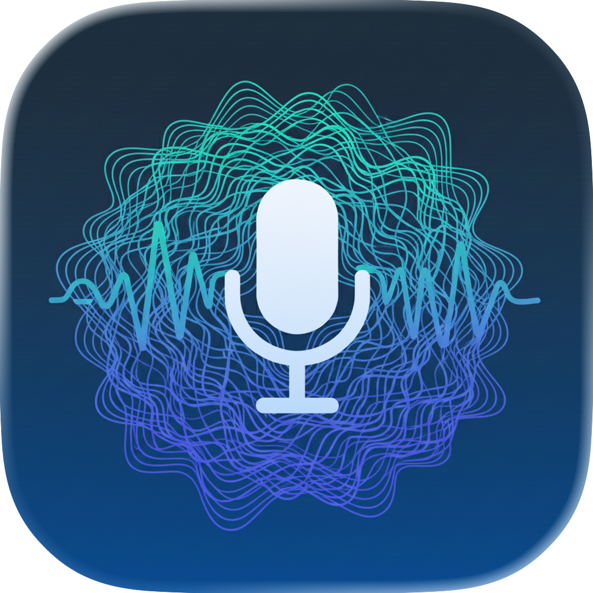

# AudioWhisper 🎙️

A lightweight macOS menu bar app for fast, **fully on-device** audio transcription. Press a hotkey, speak, and get text on your clipboard — nothing ever leaves your Mac.

<p align="center">
  
</p>

> **About this fork.** This is [jtn0123/AudioWhisper](https://github.com/jtn0123/AudioWhisper), a personal fork of
> [mazdak/AudioWhisper](https://github.com/mazdak/AudioWhisper). It has diverged: the cloud
> transcription providers (OpenAI, Google Gemini) have been **removed**, and this fork is
> local-only. Upstream still ships them. Prebuilt binaries and the Homebrew cask are published
> by upstream and are **not** this code — see [Installation](#installation-️).

## Features ✨

- **Global hotkey + push-to-talk** — Default ⌘⇧Space, optional press-and-hold on a modifier key, and an Express Mode that starts/stops with a single press
- **Two offline engines** — WhisperKit (CoreML, runs on Intel and Apple Silicon) and Parakeet-MLX (Apple Silicon, 25 languages), with built-in model download and verification
- **Semantic clean-up** — Optional on-device MLX pass that fixes typos, punctuation, and filler words, with app-aware categories (Terminal / Coding / Email / …)
- **Transcribe files** — Menu bar → "Transcribe Audio File..." for existing audio
- **History & insights** — Opt-in local transcript history with search and retention, plus a usage dashboard (sessions, words, WPM, time saved)
- **Smart paste & focus** — Clipboard copy plus optional auto-⌘V, then returns focus to the app you came from
- **Private by construction** — No API keys, no network calls for transcription, no analytics

## Requirements 📋

- **macOS 14.0 (Sonoma) or later**
- **Apple Silicon** for Parakeet and on-device semantic correction. WhisperKit works on Intel, just slower.
- **Disk space** — up to ~1.5 GB for Whisper Large Turbo, ~2.5 GB for a Parakeet model, ~0.6–2.4 GB for a correction model. Models cache under `~/.cache/huggingface/hub`.
- **Building from source: Xcode 26.0+** (Swift 6.2 tooling). The binding constraint is the `KeyboardShortcuts` 3.x dependency, whose manifest declares `swift-tools-version: 6.2`; older Xcode fails resolution outright with "incompatible tools version". `swift-argument-parser` 1.8.x needs only 6.0, so its floor is no longer the one that bites.

## Installation 🛠️

This fork publishes **no releases and no Homebrew tap**. Build it from source:

```bash
git clone https://github.com/jtn0123/AudioWhisper.git
cd AudioWhisper

make build                        # produces AudioWhisper.app
cp -R AudioWhisper.app /Applications/
open /Applications/AudioWhisper.app
```

`make run` does all of the above in one step.

> Looking for a prebuilt `.app` or `brew install`? Those are published by
> **upstream** ([mazdak/AudioWhisper](https://github.com/mazdak/AudioWhisper/releases),
> `brew tap mazdak/tap`). That is a different build with cloud providers still
> included — installing it will not give you this code.

**After deploying a new build**, macOS invalidates Accessibility permission whenever the code
signature changes. If Smart Paste stops working, remove and re-add AudioWhisper under
System Settings → Privacy & Security → Accessibility.

## Setup 🔧

### Transcription engines

**Local WhisperKit (CoreML)**
- Four models: Tiny (39 MB), Base (142 MB), Small (466 MB), Large Turbo (1.5 GB)
- Download from Dashboard → **Models**. Runs on the Neural Engine, with per-model verify and delete.

**Parakeet-MLX** — *Apple Silicon only*
- Choose **v2 English** or **v3 Multilingual** (25 languages, ~2.5 GB each)
- Click **Install Dependencies** to bootstrap the bundled uv/Python environment, then **Verify Parakeet Model**

### Semantic correction (optional)

- Modes: **Off** or **Local MLX** (Apple Silicon)
- Pick a correction model in Dashboard → **Models** (Correction section). The recommended default is `Qwen3-1.7B-4bit`.
- App-aware categories (Terminal / Coding / Chat / Writing / Email / General) are editable in Dashboard → **Categories**
- Override any prompt by dropping a `*_prompt.txt` file into
  `~/Library/Application Support/AudioWhisper/prompts/` (e.g. `terminal_prompt.txt`)

### History & usage stats (optional)

- Enable **Save Transcription History** in Dashboard → **General**; retention: 1 week / 1 month / 3 months / forever
- Dashboard → **Transcripts** offers search, expand, delete, and clear-all — all stored locally
- The usage dashboard shows sessions, words, WPM, time saved, and keystrokes saved; rebuild from history or reset anytime

### Productivity toggles

- **Express Mode** — the hotkey starts/stops recording and pastes without opening the window
- **Press & Hold** — hold a chosen modifier (⌘ / ⌥ / ⌃ / Fn) to record; requires Accessibility permission
- **Smart Paste** — auto-⌘V after transcription; requires Accessibility permission
- Auto-boost microphone input while recording, start at login, completion sound

### First run

1. Launch AudioWhisper — it lives in the menu bar, with no dock icon
2. A welcome dialog offers to open the Dashboard
3. Pick your engine:
   - **Local WhisperKit** — choose a model; the download starts automatically
   - **Parakeet-MLX** — Install Dependencies → Verify Parakeet Model
4. Optionally enable semantic correction, history, Smart Paste, Express Mode, or Press & Hold

## Usage 🎯

1. **Press ⌘⇧Space.** With Express Mode on, the first press starts recording and the next stops and pastes without showing the window.
2. **Start/stop** by clicking the mic or pressing Space — or hold your modifier key in Press & Hold mode.
3. **Cancel** with ESC at any time.
4. **Paste** — text lands on the clipboard; with Smart Paste on it auto-⌘Vs into the previous app and returns focus.
5. **Transcribe a file** — Menu bar → **Transcribe Audio File...**

## Keyboard Shortcuts ⌨️

| Action | Shortcut |
|--------|----------|
| Toggle window / Express hotkey | ⌘⇧Space (configurable) |
| Press & Hold (optional) | Hold ⌘ / ⌥ / ⌃ / Fn |
| Start/stop in window | Space |
| Cancel / close window | ESC |
| Open Dashboard | Menu bar → Dashboard... |

## Privacy & Security 🔒

- **Audio never leaves your Mac.** Both engines run on-device, as does semantic correction. There is no cloud transcription path in this fork and no API key to configure.
- **Network access** is used only to download models from Hugging Face, and only when you ask for one.
- **History**, if enabled, is stored locally in SwiftData and honours your retention setting.
- **Permissions** — Microphone for recording; Accessibility for Smart Paste and Press & Hold. Nothing else.
- **No tracking** — no analytics, no telemetry, no crash reporting.
- **Not sandboxed** — required for global hotkeys and synthetic ⌘V. See [ADR 0001](docs/adr/0001-no-sandbox.md) for the reasoning and trade-offs.

## Building from Source 👨‍💻

```bash
swift build                # debug build
swift run                  # run in development
swift build -c release     # release binary
make build                 # full .app bundle with icon
make test                  # test suite
```

See [CONTRIBUTING.md](CONTRIBUTING.md) for the full development guide and
[docs/adr/](docs/adr/) for architecture decisions.

## Troubleshooting 🔧

**"Unidentified Developer" warning**
Right-click the app → Open → confirm once.

**Smart Paste or Press & Hold not working**
System Settings → Privacy & Security → Accessibility → enable AudioWhisper. Re-add it after any rebuild — a changed code signature invalidates the grant.

**Microphone not detected**
System Settings → Privacy & Security → Microphone → enable AudioWhisper.

**Local models missing or failing**
Dashboard → **Models** → Local Whisper: download or verify the selected model.

**Parakeet or MLX not ready**
Apple Silicon only. Dashboard → **Models** → Parakeet → Install Dependencies → Verify Parakeet Model.

**Semantic correction not applying**
Dashboard → **Models** → Correction: confirm the mode is Local MLX and that the selected model is downloaded. Correction fails open — if it errors, you still get the raw transcript.

**Build fails resolving dependencies** ("incompatible tools version")
Your Xcode is too old. `KeyboardShortcuts` 3.x declares `swift-tools-version: 6.2`, so this needs **Xcode 26.0+**. Check with `swift --version` — if it reports below 6.2, point at a newer Xcode: `sudo xcode-select -s /Applications/Xcode.app/Contents/Developer`.

**Build fails with `Failed to decode version info for '/usr/bin/actool'`**
`xcode-select -p` is pointing at Command Line Tools, which has no `actool`, and the app compiles an asset catalog. The build scripts work around this automatically via `scripts/lib/xcode-env.sh`; to fix it globally, run the `xcode-select -s` command above.

## Contributing 🤝

Pull requests welcome — please target **this** repository (`jtn0123/AudioWhisper`), branch `master`.
Note that `gh pr create` defaults to the upstream parent, so pass `--repo jtn0123/AudioWhisper` explicitly.

## License 📄

MIT — see [LICENSE](LICENSE).

## Dependencies 📦

- [WhisperKit](https://github.com/argmaxinc/WhisperKit) — CoreML speech recognition · MIT
- [KeyboardShortcuts](https://github.com/sindresorhus/KeyboardShortcuts) — global hotkeys · MIT
- [ViewInspector](https://github.com/nalexn/ViewInspector) — SwiftUI testing · MIT
- [MLX](https://github.com/ml-explore/mlx) and [parakeet-mlx](https://github.com/senstella/parakeet-mlx) — Python, bootstrapped at runtime via a bundled [uv](https://github.com/astral-sh/uv) · MIT

## Acknowledgments 🙏

- Forked from [mazdak/AudioWhisper](https://github.com/mazdak/AudioWhisper)
- Built with SwiftUI and AppKit
- Local transcription powered by WhisperKit with CoreML acceleration
- Parakeet-MLX for an accessible accelerated Python interface to NVIDIA's Parakeet models
- The MLX stack for on-device semantic correction

---

Made with ❤️ for the macOS community.
