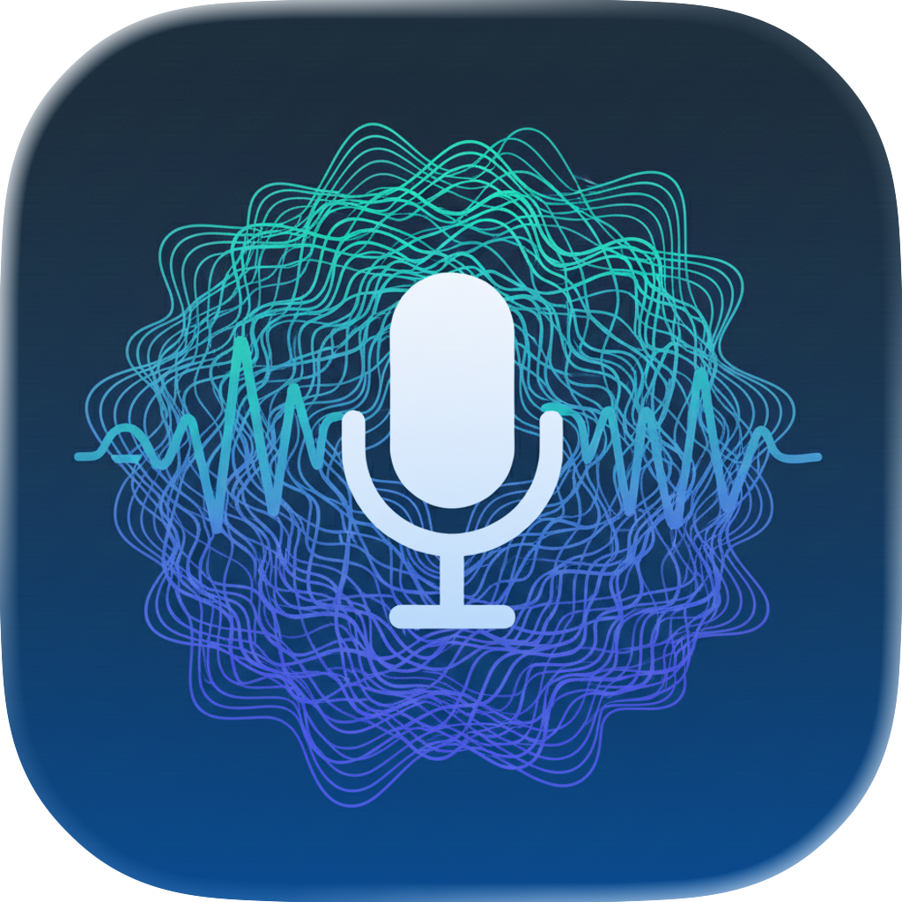

# AudioWhisper 🎙️

A lightweight macOS menu bar app for fast, **fully on-device** audio transcription. Press a hotkey, speak, and get text on your clipboard — nothing ever leaves your Mac.

<p align="center">
  
</p>

> **About this fork.** This is [jtn0123/AudioWhisper](https://github.com/jtn0123/AudioWhisper), a personal fork of
> [mazdak/AudioWhisper](https://github.com/mazdak/AudioWhisper). It has diverged: the cloud
> transcription providers (OpenAI, Google Gemini) have been **removed**, and this fork is
> local-only. Upstream still ships them. Prebuilt binaries and the Homebrew cask are published
> by upstream and are **not** this code — see [Installation](#installation-️).

## Native v2 preview

This branch rebuilds the app shell, setup, session ownership and every main screen. It is an isolated development preview, not a replacement for the installed app. See [rebuild notes](docs/rebuild.md) for feature coverage and remaining verification.

- **One workspace** — recording, transcript library, models/setup, writing profiles and preferences.
- **Explicit setup** — only the Allow microphone button requests access; blocked shortcuts open the same setup window. Readiness requires the selected voice model and runtime.
- **One recording/job owner** — cancellation suppresses late delivery, settings are captured at the start, failed audio can be retried, cleanup failure preserves the original transcript.
- **Two local engines** — Whisper on Intel/Apple Silicon and Parakeet on Apple Silicon, with installation, progress, verification and removal.
- **Writing tools** — optional local MLX cleanup, editable custom profiles and per-app assignments.
- **Files and library** — audio picker/drop, opt-in history, search, pagination, copying, bounded export, deletion and retention.
- **Personalization** — shortcuts, hold-to-record, Express Mode, microphone/input boost, sound, startup, light/dark appearance and recorder visuals.
- **Conventional windows** — the workspace stays on a desktop Space; only the recording overlay may cover full-screen apps.

The preview uses `com.audiowhisper.rebuild` and a separate Application Support directory. Recording shortcuts start disabled so the original app can remain open. No permissions, old transcripts or settings are migrated automatically.

## Requirements 📋

- **macOS 14.0 (Sonoma) or later**
- **Apple Silicon** for Parakeet and on-device semantic correction. WhisperKit works on Intel, just slower.
- **Disk space** — up to ~1.5 GB for Whisper Large Turbo, ~2.5 GB for a Parakeet model, ~0.6–2.4 GB for a correction model. Models cache under `~/.cache/huggingface/hub`.
- **Building from source: Xcode 26.0+** (Swift 6.2 tooling). The binding constraint is the `KeyboardShortcuts` 3.x dependency, whose manifest declares `swift-tools-version: 6.2`; older Xcode fails resolution outright with "incompatible tools version". `swift-argument-parser` 1.8.x needs only 6.0, so its floor is no longer the one that bites.

## Installation 🛠️

This fork publishes **no releases and no Homebrew tap**. Build it from source:

```bash
git clone https://github.com/jtn0123/AudioWhisper.git
cd AudioWhisper

make build                        # produces the preview at AudioWhisper.app
# Launch that bundle from Finder, or:
make run                          # installs beside the original as AudioWhisper Rebuild.app
```

`make run` preserves `/Applications/AudioWhisper.app`. Without a configured signing identity, the completed preview bundle is signed ad hoc for local use. macOS retains its permissions for that build across launches; a different build can require a new grant. Distribution still requires a Developer ID and notarization.

> Looking for a prebuilt `.app` or `brew install`? Those are published by
> **upstream** ([mazdak/AudioWhisper](https://github.com/mazdak/AudioWhisper/releases),
> `brew tap mazdak/tap`). That is a different build with cloud providers still
> included — installing it will not give you this code.

For repeated development builds, use the persistent local signing identity
described in [the rebuild notes](docs/rebuild.md). Switching signing identity can
require fresh consent. If Smart Paste stops working, check the app's entry under
System Settings → Privacy & Security → Accessibility.

The [macOS VM QA workflow](scripts/vm/README.md) provides repeatable desktop tests;
[the observed results](.Codex/macos-vm-validation.md) distinguish virtual guest
coverage from physical hardware acceptance.

## Setup 🔧

### Transcription engines

**Local WhisperKit (CoreML)**
- Four models: Tiny (39 MB), Base (142 MB), Small (466 MB), Large Turbo (1.5 GB)
- Download from Models & setup. Runs on the Neural Engine, with per-model verify and delete.

**Parakeet-MLX** — *Apple Silicon only*
- Choose **v2 English** or **v3 Multilingual** (25 languages, ~2.5 GB each)
- Click **Install voice model** to prepare the runtime and selected model, then **Verify model**

### Semantic correction (optional)

- Modes: **Off** or **Local MLX** (Apple Silicon)
- Pick a correction model in Models & setup (Correction section). The recommended default is `Qwen3-1.7B-4bit`.
- App-aware categories (Terminal / Coding / Chat / Writing / Email / General) are editable in Writing profiles
- Override any prompt by dropping a `*_prompt.txt` file into
  `~/Library/Application Support/AudioWhisper Rebuild/prompts/` (e.g. `terminal_prompt.txt`)

### History & usage stats (optional)

- Enable **Save Transcription History** in Preferences; retention: 1 week / 1 month / 3 months / forever
- Library offers search, expand, delete, and clear-all — all stored locally
- The recording page shows sessions, words and estimated time saved. Preferences offers recalculation from history and reset.

### Productivity toggles

- **Express Mode** — the hotkey starts/stops recording and pastes without opening the window
- **Press & Hold** — hold a chosen modifier (⌘ / ⌥ / ⌃ / Fn) to record; requires Accessibility permission
- **Smart Paste** — auto-⌘V after transcription; requires Accessibility permission
- Auto-boost microphone input while recording, start at login, completion sound

### First run

1. Launch AudioWhisper and open Models & setup. The app lives in the menu bar and shows a Dock icon while a normal window is open.
2. Click **Allow microphone** and respond to the macOS prompt. If access was previously denied, Setup opens the Microphone settings instead.
3. Choose your transcription engine and voice model, then install it from the same Setup page. Parakeet requires Apple Silicon; its install includes the local Python environment.
4. Wait for **Ready to record**. Both microphone access and the selected voice model must be available. Using the recording shortcut before then opens Setup without recording or requesting more permissions.
5. Smart Paste, semantic correction, history, Express Mode, and Press & Hold are optional. Smart Paste's Accessibility access is configured separately; it is not required to record and copy a transcript.

## Usage 🎯

1. **Enable your shortcut in Preferences, then press ⌘⇧Space.** With Express Mode on, the first press starts recording and the next stops and pastes without showing the window.
2. **Start/stop** by clicking the mic or pressing Space — or hold your modifier key in Press & Hold mode.
3. **Cancel** with ESC at any time.
4. **Paste** — text lands on the clipboard; with Smart Paste on it auto-⌘Vs into the previous app and returns focus.
5. **Transcribe a file** — Menu bar → **Transcribe Audio File...**

## Keyboard Shortcuts ⌨️

| Action | Shortcut |
|--------|----------|
| Toggle window / Express hotkey | ⌘⇧Space (configurable) |
| Press & Hold (optional) | Hold ⌘ / ⌥ / ⌃ / Fn |
| Start/stop in window | Space |
| Cancel / close window | ESC |
| Open Dashboard | Menu bar → Dashboard... |

## Privacy & Security 🔒

- **Audio never leaves your Mac.** Both engines run on-device, as does semantic correction. There is no cloud transcription path in this fork and no API key to configure.
- **Network access** is used only to download models from Hugging Face, and only when you ask for one.
- **History**, if enabled, is stored locally in SwiftData and honours your retention setting.
- **Permissions** — Microphone for recording; Accessibility for Smart Paste and Press & Hold. Nothing else.
- **No tracking** — no analytics, no telemetry, no crash reporting.
- **Not sandboxed** — required for global hotkeys and synthetic ⌘V. See [ADR 0001](docs/adr/0001-no-sandbox.md) for the reasoning and trade-offs.

## Building from Source 👨‍💻

```bash
swift build                # debug build
swift run                  # run in development
swift build -c release     # release binary
make build                 # full .app bundle with icon
make test                  # test suite
```

See [CONTRIBUTING.md](CONTRIBUTING.md) for the full development guide and
[docs/adr/](docs/adr/) for architecture decisions.

## Troubleshooting 🔧

**"Unidentified Developer" warning**
Right-click the app → Open → confirm once.

**Smart Paste or Press & Hold not working**
System Settings → Privacy & Security → Accessibility → enable AudioWhisper.
Complete any authentication sheet before closing Settings. Development builds
should reuse the same signing identity; if that identity changed, a fresh grant
may be required.

**Microphone not detected**
System Settings → Privacy & Security → Microphone → enable AudioWhisper.

**Local models missing or failing**
Models & setup → Local Whisper: download or verify the selected model.

**Parakeet or MLX not ready**
Apple Silicon only. Models & setup → Parakeet → Install Dependencies → Verify Parakeet Model.

**Semantic correction not applying**
Models & setup → Correction: confirm the mode is Local MLX and that the selected model is downloaded. Correction fails open — if it errors, you still get the raw transcript.

**Build fails resolving dependencies** ("incompatible tools version")
Your Xcode is too old. `KeyboardShortcuts` 3.x declares `swift-tools-version: 6.2`, so this needs **Xcode 26.0+**. Check with `swift --version` — if it reports below 6.2, point at a newer Xcode: `sudo xcode-select -s /Applications/Xcode.app/Contents/Developer`.

**Build fails with `Failed to decode version info for '/usr/bin/actool'`**
`xcode-select -p` is pointing at Command Line Tools, which has no `actool`, and the app compiles an asset catalog. The build scripts work around this automatically via `scripts/lib/xcode-env.sh`; to fix it globally, run the `xcode-select -s` command above.

## Contributing 🤝

Pull requests welcome — please target **this** repository (`jtn0123/AudioWhisper`), branch `master`.
Note that `gh pr create` defaults to the upstream parent, so pass `--repo jtn0123/AudioWhisper` explicitly.

## License 📄

MIT — see [LICENSE](LICENSE).

## Dependencies 📦

- [WhisperKit](https://github.com/argmaxinc/WhisperKit) — CoreML speech recognition · MIT
- [KeyboardShortcuts](https://github.com/sindresorhus/KeyboardShortcuts) — global hotkeys · MIT
- [ViewInspector](https://github.com/nalexn/ViewInspector) — SwiftUI testing · MIT
- [MLX](https://github.com/ml-explore/mlx) and [parakeet-mlx](https://github.com/senstella/parakeet-mlx) — Python, bootstrapped at runtime via a bundled [uv](https://github.com/astral-sh/uv) · MIT

## Acknowledgments 🙏

- Forked from [mazdak/AudioWhisper](https://github.com/mazdak/AudioWhisper)
- Built with SwiftUI and AppKit
- Local transcription powered by WhisperKit with CoreML acceleration
- Parakeet-MLX for an accessible accelerated Python interface to NVIDIA's Parakeet models
- The MLX stack for on-device semantic correction

---

Made with ❤️ for the macOS community.

### Recording diagnostics

For a read-only setup check from the built app:

```bash
AudioWhisper.app/Contents/MacOS/AudioWhisper --diagnose-recording
```

The command prints JSON with the build, configured recording shortcut, selected voice model, model/runtime availability, microphone and Smart Paste permission states, and the next required setup step, then exits. It does not include transcripts, history or credentials. Permissions are reported for this diagnostic process; desktop prompts and focus behavior still require checking the running app.
